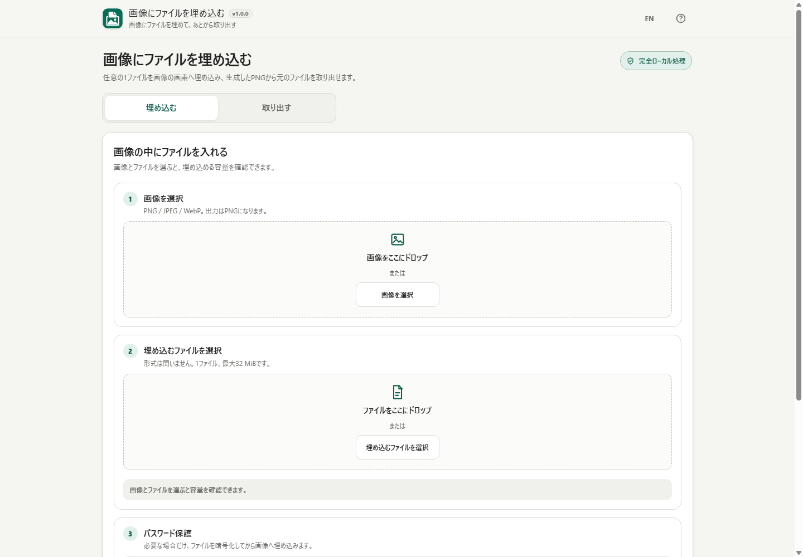

# File in Image / 画像にファイルを埋め込む

[](https://github.com/ttomohisa/htmlapps-file-in-image/actions/workflows/deploy-pages.yml)
[](LICENSE)
[](https://ttomohisa.github.io/htmlapps-file-in-image/)

[English README](README.md)

任意の1ファイルを画像の画素へ埋め込み、生成したPNGからあとで元のファイルを取り出すブラウザーツールです。登録・インストールは不要で、選択した画像・ファイル・パスワード・復元データは端末内で処理します。

## 🚀 デモ

### [GitHub PagesでFile in Imageを開く](https://ttomohisa.github.io/htmlapps-file-in-image/)

GitHub Pagesから最初のHTMLを読み込んだ後、画像の読み込み、GZIP、暗号化、適応埋め込み、生成PNGの自動復元確認、ファイルの取り出しはブラウザー内で実行されます。選択した画像やファイルをアプリからサーバーへ送信しません。

[](https://ttomohisa.github.io/htmlapps-file-in-image/)

## 主な機能

ヘッダーの言語切替は切替先の `EN` / `JA` を表示し、説明とツールチップも現在の言語に合わせます。バージョン表示は `v1.0.1`、処理バッジは「完全ローカル処理」です。

- **任意の1ファイルを画像へ埋め込み** — PNG / JPEG / WebPを元画像に使い、埋め込み後はPNGとして保存します。
- **入力ごとに選択を解除** — 読み込み中も画像またはファイルの選択を解除でき、もう一方の入力とパスワード設定は保持します。
- **実際に使える容量を事前確認** — 完全に不透明なRGB画素と、圧縮後を含む実際の埋め込みサイズから容量を判定します。
- **小さくなる場合だけGZIP** — BKFC全体を圧縮し、元より小さくなる場合だけGZIPを採用します。
- **必要なときだけパスワード保護** — 元ファイル名を含む埋め込みデータをPBKDF2-HMAC-SHA-256 + AES-256-GCMで保護できます。
- **画像の高ディテール領域を優先** — 8×8ブロックを解析して、変化が目立ちにくい領域から優先的に埋め込みます。
- **保存前に本当に復元できるか確認** — 生成したPNGをもう一度読み直し、元ファイルの復元とSHA-256一致まで確認できた場合だけ保存できます。
- **過去バージョンも復元** — v1.0.1はformat version 1を書き出し、v0.2.0〜v0.8.0で作ったversion 0画像も読み込めます。
- **完全ローカル処理の単一HTML** — runtime依存ライブラリ0件、`connect-src 'none'`、日本語 / 英語UIで構成しています。

## すぐに使う

### Webで使う

[GitHub Pagesのデモ](https://ttomohisa.github.io/htmlapps-file-in-image/)を開くだけで利用できます。登録やインストールは不要です。

### ローカルの単一HTMLとして使う

1. このリポジトリをダウンロードまたはクローンします。
2. Windowsで `build-standalone.bat` を実行します。
3. 生成された `dist/index.html` を開きます。
4. 以後はそのHTMLを `file://` で直接開いて利用できます。

アプリ本体に第三者runtimeパッケージはありません。通常のビルドはWindows PowerShellで実行できます。repository全体の検証ではformat regressionのためNode.js 24も使用します。

## 使い方

### ファイルを画像へ埋め込む

1. PNG / JPEG / WebP画像を選ぶか、ドロップします。
2. 埋め込みたい1ファイル（最大32 MiB）を選びます。
3. 表示された容量に収まることを確認します。
4. 必要なら「パスワードで保護する」をONにし、同じパスワードを2回入力します。
5. **画像に埋め込む** を実行します。
6. PNG生成後、自動復元確認が完了するまで待ちます。
7. 必要なら出力ファイル名を変更してPNGを保存します。

ファイル読み込み後は選択欄がコンパクトになります。**変更**ボタンでも、同じ領域への再ドロップでも差し替えられます。

各入力欄の **選択を解除** で、読み込み中を含めてその入力だけを取り除けます。もう一方の入力とパスワード設定は保持されます。入力の解除・変更で以前の生成PNGは無効になるため、保存前に再度埋め込んでください。端末の元ファイルは削除されません。画像とファイルを続けて選んでも、それぞれ独立して読み込まれます。

### 画像からファイルを取り出す

1. **取り出す** タブへ切り替えます。
2. File in Imageで作成したPNGを選ぶか、ドロップします。
3. パスワード保護されている場合はパスワードを入力します。
4. **ファイルを取り出す** を実行します。
5. 埋め込み時のSHA-256と一致した場合だけ保存できます。
6. 必要なら復元ファイル名を変更して保存します。

### パスワード表示

各パスワード欄の目アイコンで表示 / 非表示を切り替えられます。パスワード保護をOFFにした場合や、取り出し側で別のPNGを選んだ場合は伏字表示へ戻ります。

## 「適応埋め込み」について

File in Imageは画像を8×8ブロックに分け、LSBの影響を取り除いた輝度と整数Sobel評価からディテール量を求めます。ディテールが多いブロックを優先し、その中の画素・RGB channelを決定的に並べ替えて埋め込みます。

これは1bitのRGB変化を特定の平坦領域へ集中させにくくするための処理です。**画像編集への耐性を付けるものでも、埋め込みを検出不能にするものでもありません。**

## 互換形式

v1.0.1ではv0.9.0でfreezeした互換形式を正式採用しています。

- BKFI outer format version 1
- BKFC inner container version 1
- adaptive embedding mode 1
- BKFI header 80 bytes
- BKFC fixed header 48 bytes

v0.2.0〜v0.8.0で作成したversion 0画像も読み込めます。旧sequential mode 0とadaptive mode 1の両方をdecode対象として残しています。

詳しいバイナリ形式とアルゴリズムは [APP_SPEC.md](APP_SPEC.md) を確認してください。

## GitHub Pagesで公開する

このリポジトリには、単一HTMLを再生成・検証してから `dist` をGitHub Pagesへ公開するworkflowが含まれています。

1. **Settings → Pages → Build and deployment → Source** で **GitHub Actions** を選択します。
2. `main` へpushするか、Actionsから **Deploy standalone app to GitHub Pages** を手動実行します。
3. PowerShell検証、Node.js 24のformat regression、standalone / self-extract検証を通過した `dist` だけが公開されます。

## 開発とビルド

Node.jsで `node scripts/check-header-regression.mjs` を実行すると、実際のアプリスクリプトによる初期言語、繰り返し切替、設定の再読み込み、ストレージ利用不可時の動作、バージョンとローカル処理表示を検証できます。引数に `dist/index.html` または `dist/index.self-extract.html` を渡すと生成物も検証します。DOM境界を置き換えるソースレベルのテストで、ブラウザー表示の検証ではありません。

```text
.
├─ src/index.template.html              # アプリ本体
├─ app.config.json                      # アプリ情報 / version / build設定
├─ assets/favicon.svg                   # favicon / 左上アプリアイコンの共通元
├─ dependencies.json                    # runtime依存定義（空）
├─ scripts/check-format-regression.mjs  # BKFI/BKFC + Worker互換性回帰
├─ scripts/check-repository.ps1         # repository全体検証
├─ build-standalone.bat                 # Windows用ビルド入口
├─ build-standalone.ps1                 # standalone / self-extract生成
└─ dist/                                # 生成物
```

repository全体を検証する場合：

```powershell
powershell.exe -NoLogo -NoProfile -ExecutionPolicy Bypass -File .\scripts\check-repository.ps1
```

format互換、単一HTML、self-extract復元、favicon / 左上アイコン、CSPによるruntime通信遮断などをまとめて確認します。

## プライバシーと通信防止

生成HTMLのContent Security Policyでは、少なくとも次を使用しています。

```text
connect-src 'none'
worker-src 'self' blob:
```

画像、埋め込むファイル、パスワード、生成PNG、復元データはブラウザー内で処理します。runtime CDN・API・analytics・telemetry・第三者ライブラリは使用していません。

GitHub Pages版では最初のHTML取得は発生します。ダウンロード後にネットワーク接続なしで使う場合は、生成済みの `dist/index.html` を直接開いてください。

## 制限事項

- 一度に埋め込めるのは1ファイルです。
- 元ファイルは最大32 MiBです。
- 出力形式はPNGのみです。
- 埋め込み容量には完全に不透明な画素だけを使用します。
- 生成PNGのリサイズ、トリミング、フィルター、スクリーンショット、JPEG/非可逆WebP変換、SNS・メッセージアプリ等による再圧縮でデータが壊れる可能性があります。
- 適応埋め込みは画素変更の集中を避けるための処理であり、ステガノグラフィ検出への不可視性や画像編集耐性を保証しません。
- 高解像度画像ではCanvas / ImageDataのため端末メモリを多く使用する場合があります。
- GZIP生成には `CompressionStream`、GZIP復元には `DecompressionStream` が必要です。
- パスワード保護されたデータの復元にはWeb Cryptoが必要です。
- Blob Web Workerが利用できない環境では適応画像処理を実行できません。

## 使用ライブラリ

**第三者runtimeライブラリはありません。**

Canvas、Web Crypto、Compression Streams、Blob URL、Web Workerなどブラウザー標準APIを直接使用しています。

repositoryのnotice方針は [THIRD_PARTY_NOTICES.md](THIRD_PARTY_NOTICES.md) を確認してください。

## コントリビューション

バグ報告や機能提案はGitHub Issuesからお願いします。開発への参加方法は [CONTRIBUTING.md](CONTRIBUTING.md) を確認してください。

## ライセンス

Copyright © 2026 ttomohisa

このプロジェクトは [MIT License](LICENSE) で公開されています。
