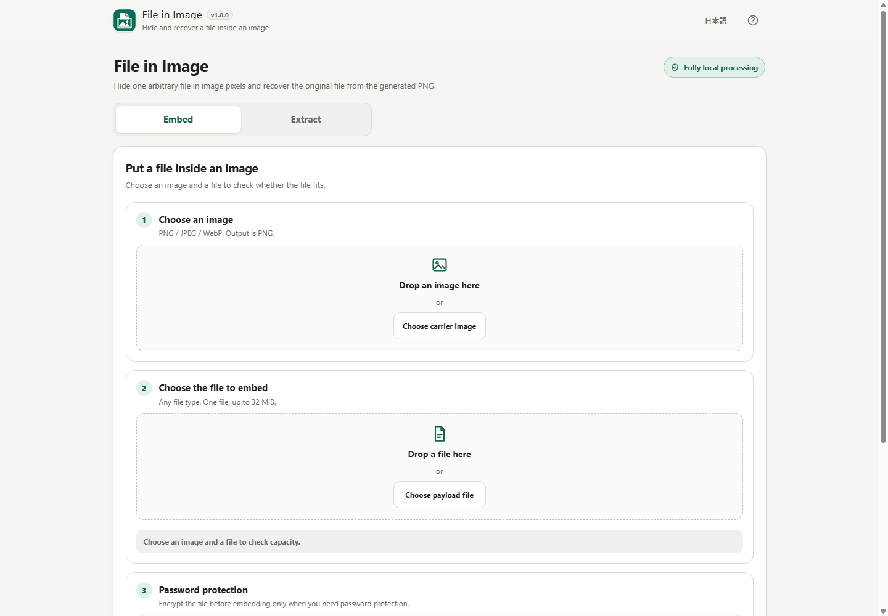

# File in Image

[](https://github.com/ttomohisa/htmlapps-file-in-image/actions/workflows/deploy-pages.yml)
[](LICENSE)
[](https://ttomohisa.github.io/htmlapps-file-in-image/)

[日本語版 README](README.ja.md)

A browser-only tool that hides one arbitrary file inside image pixels and recovers it later from the generated PNG. No account or installation is required, and the selected image, payload, password, and recovered bytes stay on the device.

## 🚀 Live demo

### [Open File in Image on GitHub Pages](https://ttomohisa.github.io/htmlapps-file-in-image/)

GitHub Pages delivers the initial HTML. After it loads, image decoding, GZIP, encryption, adaptive embedding, generated-PNG verification, and recovery run locally in the browser. The app does not upload the selected files.

[](https://ttomohisa.github.io/htmlapps-file-in-image/)

## Features

- **Hide one arbitrary file inside an image** — Use a PNG, JPEG, or WebP carrier and save the result as PNG.
- **Check real capacity before embedding** — Capacity is calculated from fully opaque RGB pixels and the actual prepared payload size.
- **Compress only when it helps** — The complete inner container is GZIP-compressed only when that makes it smaller.
- **Optional password protection** — Protect the embedded data, including the original filename, with PBKDF2-HMAC-SHA-256 and AES-256-GCM.
- **Prefer higher-detail image areas** — Adaptive 8×8 analysis prioritizes visually busy regions while keeping deterministic recovery.
- **Verify before Save** — The generated PNG is decoded again and the original file must be recovered and SHA-256 verified before Save is enabled.
- **Recover older File in Image output** — Stable format version 1 is written by v1.0.0 while version 0 output from v0.2.0–v0.8.0 remains readable.
- **Private single-HTML operation** — Runtime dependencies are zero, `connect-src 'none'` blocks runtime network access, and Japanese/English UI is included.

## Quick start

### Use the web demo

Open the [GitHub Pages demo](https://ttomohisa.github.io/htmlapps-file-in-image/). No installation or account is required.

### Build a local single HTML

1. Download or clone this repository.
2. Run `build-standalone.bat` on Windows.
3. Open `dist/index.html`.
4. You can later open that generated file directly with `file://`.

The application has no third-party runtime package to download. The normal builder uses Windows PowerShell. Full repository verification also runs the format regression with Node.js 24.

## Usage

### Embed a file

1. Choose or drop a PNG, JPEG, or WebP carrier image.
2. Choose one payload file up to 32 MiB.
3. Confirm that the prepared payload fits the displayed capacity.
4. Optionally enable password protection and enter the password twice.
5. Select **Embed in image**.
6. Wait for the app to create the PNG and automatically recover the file from that generated PNG.
7. Edit the suggested PNG filename if needed, then save it.

After a file is selected, the picker becomes compact. You can still replace it with the **Change** button or by dropping another file onto the same area.

### Recover a file

1. Switch to **Extract**.
2. Choose or drop a PNG created by File in Image.
3. Enter the password if the image is protected.
4. Select **Extract file**.
5. The app verifies the embedded SHA-256 digest before enabling Save.
6. Edit the recovered filename if needed and save the file.

### Password visibility

Each password field has a show/hide button. Turning password protection off, or choosing another protected PNG on the Extract side, returns the field to masked display.

## What “adaptive embedding” means

File in Image scores 8×8 image blocks using LSB-independent luminance and an integer Sobel detail measure. Higher-detail blocks are preferred, then pixel/channel positions are deterministically shuffled.

This is intended to make one-bit RGB changes less visually obvious. It is **not** a robustness feature and does not make the embedded data survive image editing.

## Format compatibility

v1.0.0 writes the stable compatibility candidate frozen in v0.9.0:

- BKFI outer format version 1
- BKFC inner container version 1
- adaptive embedding mode 1
- 80-byte BKFI header
- 48-byte BKFC fixed header

The decoder also accepts File in Image version 0 output produced by v0.2.0–v0.8.0, including legacy sequential mode 0 and adaptive mode 1.

Detailed binary and algorithm rules are documented in [APP_SPEC.md](APP_SPEC.md).

## GitHub Pages

This repository includes a workflow that rebuilds and verifies the standalone HTML before publishing `dist` to GitHub Pages.

1. In **Settings → Pages**, set **Source** to **GitHub Actions**.
2. Push to `main`, or manually run **Deploy standalone app to GitHub Pages**.
3. The workflow runs PowerShell checks, Node.js 24 format regression, standalone/self-extract verification, and then deploys the verified `dist`.

## Development and build layout

```text
.
├─ src/index.template.html              # Application source template
├─ app.config.json                      # App metadata / version / build policy
├─ assets/favicon.svg                   # Canonical favicon + header icon
├─ dependencies.json                    # Runtime dependency declaration (empty)
├─ scripts/check-format-regression.mjs  # BKFI/BKFC + Worker compatibility regression
├─ scripts/check-repository.ps1         # Full repository verification
├─ build-standalone.bat                 # Windows build entry point
├─ build-standalone.ps1                 # Standalone/self-extract builder
└─ dist/                                # Generated release artifacts
```

Run the complete repository verification:

```powershell
powershell.exe -NoLogo -NoProfile -ExecutionPolicy Bypass -File .\scripts\check-repository.ps1
```

The verification checks the build contract, format compatibility, standalone HTML, self-extract restoration, canonical favicon/app icon, and runtime network-blocking CSP.

## Privacy and runtime network protection

The generated HTML uses a Content Security Policy with:

```text
connect-src 'none'
worker-src 'self' blob:
```

Selected files and passwords are processed in browser memory. The app has no runtime CDN, API, analytics, telemetry, or third-party library dependency.

The GitHub Pages version needs the initial HTML request. For use without network access after download, open `dist/index.html` directly.

## Limitations

- One payload file is supported at a time.
- Payload size is limited to 32 MiB.
- Output is always PNG.
- Only fully opaque pixels are used for payload capacity.
- Resizing, cropping, filters, screenshots, JPEG/lossy WebP conversion, or social/messaging recompression can destroy the embedded data.
- Adaptive placement reduces visual concentration of changes; it does not make the payload undetectable or editing-resistant.
- Large/high-resolution images can use substantial memory because browser Canvas/ImageData is required.
- Creating GZIP output requires `CompressionStream`; recovering GZIP output requires `DecompressionStream`.
- Password-protected recovery requires Web Crypto support.
- If Blob Web Workers are unavailable, heavy adaptive image processing cannot run.

## Dependencies

The application has **no third-party runtime library dependencies**. It uses browser-native Canvas, Web Crypto, Compression Streams, Blob URLs, and Web Workers.

See [THIRD_PARTY_NOTICES.md](THIRD_PARTY_NOTICES.md) for the repository notice policy.

## Contributing

Bug reports and feature proposals are welcome through GitHub Issues. See [CONTRIBUTING.md](CONTRIBUTING.md) for development guidance.

## License

Copyright © 2026 ttomohisa

Licensed under the [MIT License](LICENSE).
